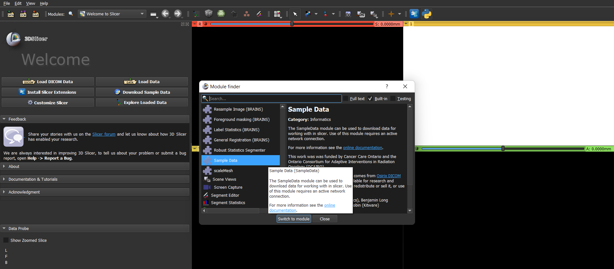
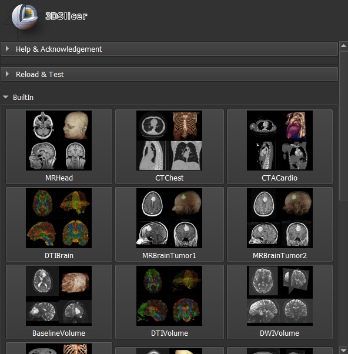
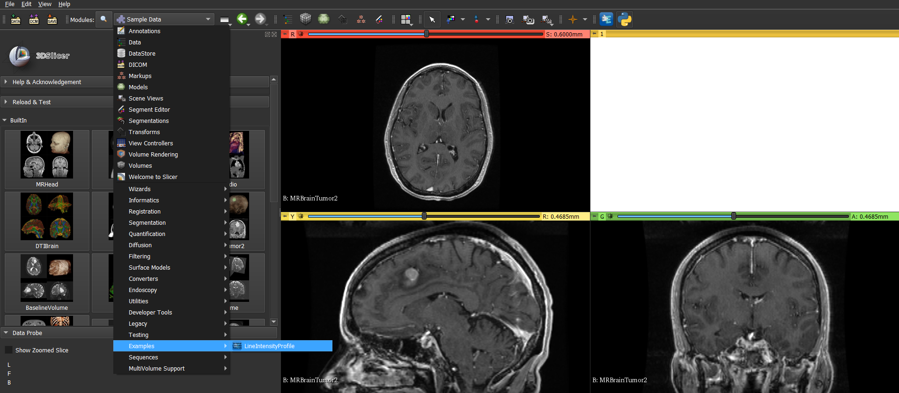
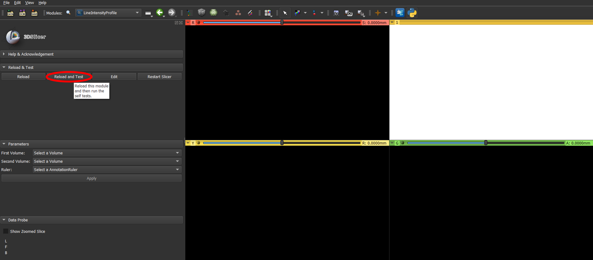
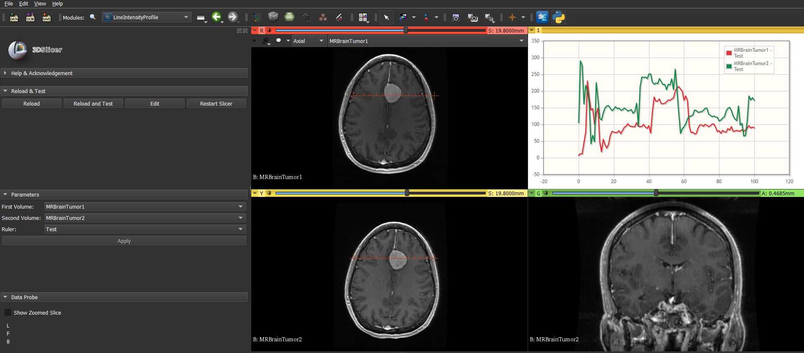
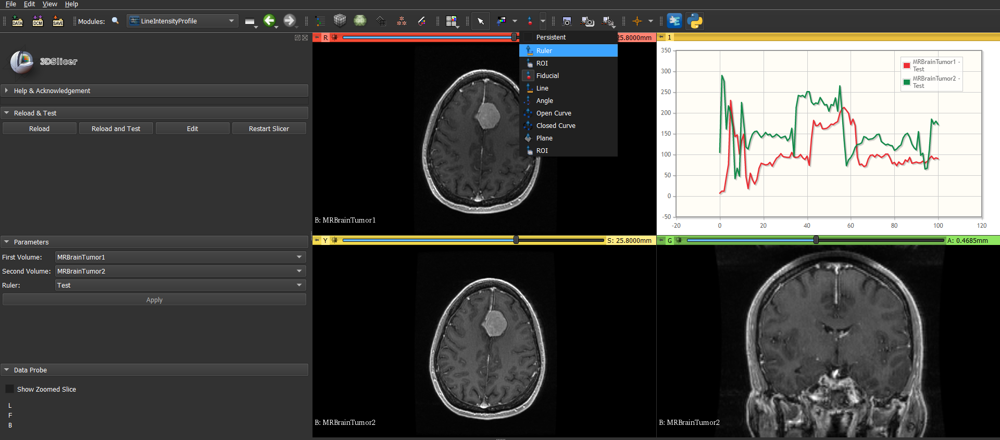
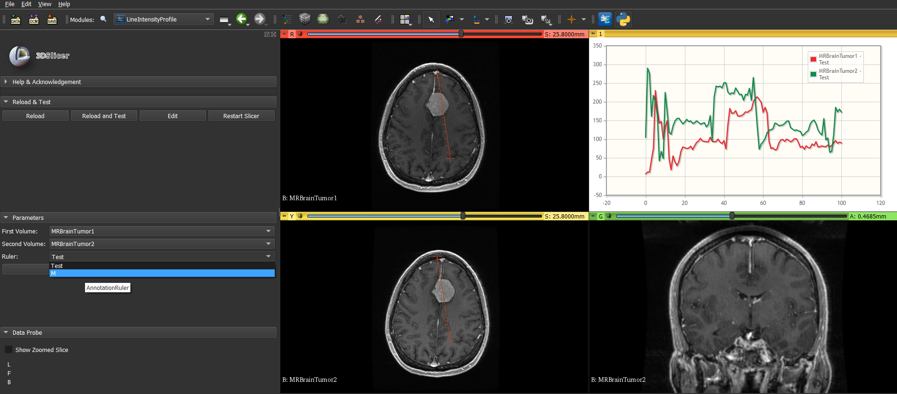
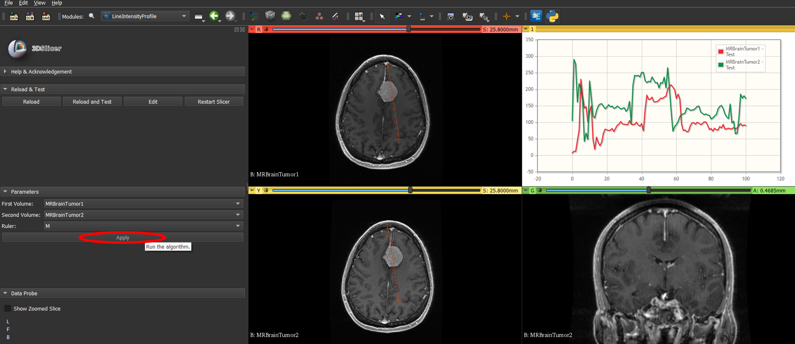
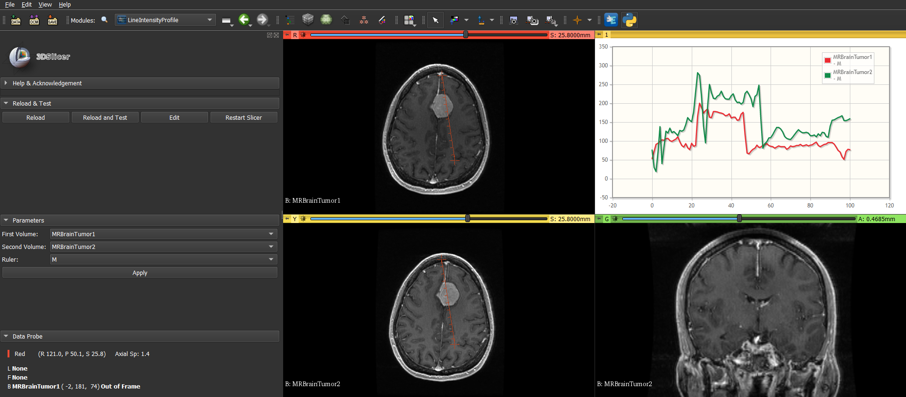

# Development of a 3D slicer Extension for **Line Intensity Profiles**

This repository contains implementation of a slicer extension to plot line intensity profiles of a drawn line in 2 given 3D images. Line intensity profile is the plot of intensity levels of pixels along a drawn line and it can be utilized to compare the noise levels of multiple images and compare physical properties of anatomical structures (E.g. Size of a tumor).

# Requirements

**1. Tools**

1. 3D Slicer - version 4.5 or above

    [Slicer](http://download.slicer.org) is a community platform created for the purpose of subject specific image analysis and visualization. There is no restriction on use, but permissions and compliance with rules are responsibility of users.

2. Text Editor

**2. Knowledge**

1. Python Programming

2. Familiarity with 3D Slicer

# Instructions

1. **Load Test Data**
    
    Module Finder → Sample data → MRBrainTumor1 and MRBrainTumor2
    
    
    
    

2. **Load Extension of Line Intensity Profile**
    
    Module List → Examples → Line Intensity Profile
    
    

3. **Click Reload and Test**
    
    MR brain slices of the two image volumes - MRBrainTumor1 and MRBrainTumor2 are loaded with a predefined ruler. Line intensity profile chart displays intensity levels of pixels along the predefined ruler.
    
    
    
    

4. **Change Ruler Placement**
    
    Create and Place → Ruler → Select two points to form a line
    
    

    Select the placed ruler from the **Ruler drop-down menu** under Parameters.
    
    

    Click Apply!
    
    
    
    

# Acknowledgment

I would like to extend my gratitude towards Dr. Nuwan Dayananda, Dr. Ranga Rodrigo and Mr. Achintha Iroshan for providing this opportunity to get hands-on-experience on slicer extension development.

# Reference

[Developing extension in 3D Slicer](https://docs.google.com/presentation/d/1JXIfs0rAM7DwZAho57Jqz14MRn2BIMrjB17Uj_7Yztc/edit#slide=id.g41f90baec_028)

